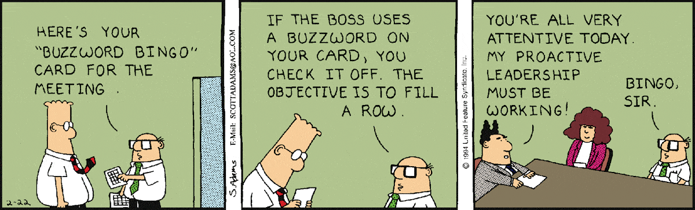

# grad-apps

I wrote applications in 2016 before I knew what I was doing. As as result, I committed at least two cardinal sins: 
- cold-emailing professors that I didn't know,
- escaping from the work of writing by cutting up and gluing together other peoples' words.

From [Philip Guo](http://www.pgbovine.net/grad-school-app-tips.htm):
> To a professor who receives tons of emails every day, there is nothing that sounds more insincere, contrived, and annoying than receiving impersonal emails from students who express an interest in his/her research, **paraphrasing the contents of abstracts** from his/her papers, and citing elaborate stories about their enthusiasm.

From [Orwell](http://www.orwell.ru/library/essays/politics/english/e_polit/):
> As soon as certain topics are raised, the concrete melts into the abstract and no one seems able to think of turns of speech that are not hackneyed: prose consists less and less of words chosen for the sake of their meaning, and more and more of **phrases tacked together like the sections of a prefabricated hen-house.**

## updates

- Univeristy of Oregon, rejected
- University of Utah, rejected
- Washington State University, accepted w/o funding
- CU Boulder, Applied Math, accepted w/o funding
- CU Boulder, Pure Math, waitlisted
- University of Rochester, rejected
